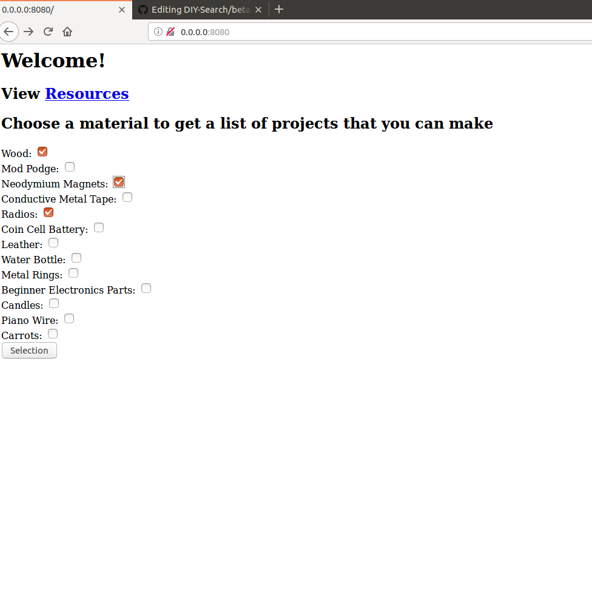
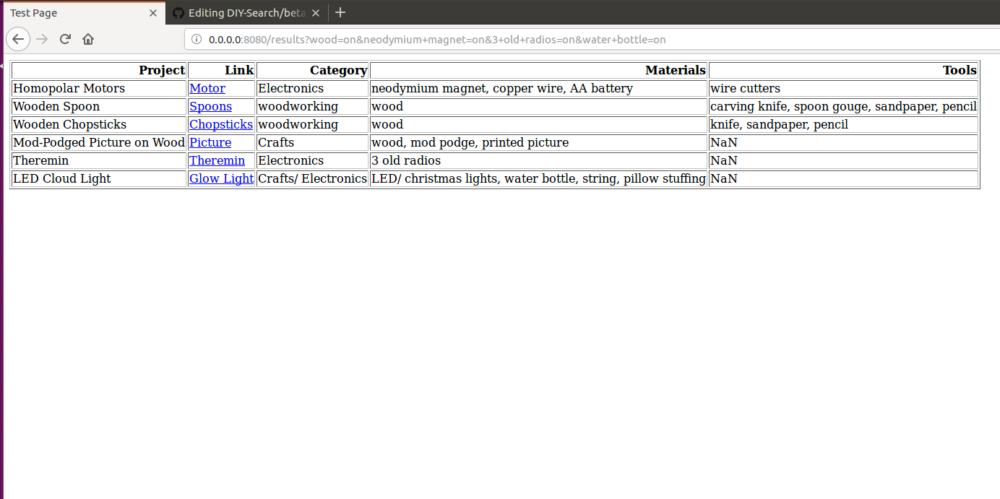

# About the Beta Model

The Beta model thus far consists of a small database of projects, a Python Script scraper and script to run an interface on a local network.

## The Database

To create the database, I created a csv file and populated it with projects that I know from my own experience to be good starter projects and projects that I found by searching existing DIY project sites.

I scraped this database using pandas.

## Interface

The interface is a html-only website that is posted onto the local network using web.py

The home page contains a link to resources and a search function for the data base.

The Resources page:

The Results page:

## In the future
In the future, I plan to
-to expand my database with a crawler that will search websites in real time
-to bring this project to the internet, instead of having it locally
-to improve the user experience with CSS and JavaScript
